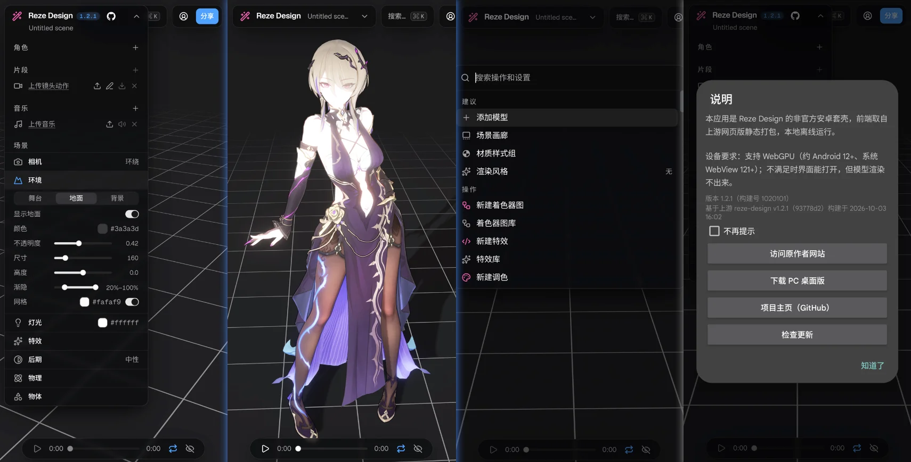

# Reze Design Android

[点我查看中文说明](README.zh-CN.md)

An unofficial Android shell for [reze-design](https://github.com/AmyangXYZ/reze-design) — the WebGPU MMD (MikuMikuDance) animation editor. Use it to **edit, play, and render MMD (MikuMikuDance) models and VMD animation clips, with real-time local rendering over WebGPU**. The upstream frontend is statically exported and bundled into the APK, so the editor runs **fully offline** on the phone, with no external services.

Shell philosophy: a bare Kotlin + system WebView wrapper that **never patches upstream sources**. All adaptation happens at build time (`scripts/`) and at runtime (`app/src/main/assets/shim/`), so the shell can keep following upstream releases instead of forking the UI.

## Screenshots



> **Screenshot credits:** model 「丽塔—窈窕谍影」 by 神帝宇 · motion by Digitrevx · screenshot by History_exe
> **Importing a model:** zip the model folder (`.pmx` + textures) and import the **zip archive** — picking a bare `.pmx` directly does not work (textures resolve from the zip's relative paths).
> **Language:** the interface is available in **English and Chinese**. It follows your device language on first launch; switch anytime via the **Language** entry in the search/command palette.

## Features

- **Fully offline**: the whole editor ships inside the APK, served to the WebView over `https://appassets.androidplatform.net/` so WebGPU still gets a secure context
- **File import**: models, motions, music and scenes through the standard file picker. Model folders must be zipped — that is the mobile path upstream itself provides (textures are resolved from the zip's relative paths)
- **Export to Downloads**: upstream exports via `<a download>` + blob URLs, which WebView silently drops without any error; the shell patches that and writes to `MediaStore.Downloads` in chunks (no storage permission needed on Android 10+; API 26–28 fall back to the app-private external directory)
- **Touch accessibility**: the role panel defaults to expanded (upstream collapses it on coarse pointers, which hides every import entry), and hover-only row buttons are forced visible
- **First-run notice**: a native dialog showing the device requirement, the build info, and links to the upstream site, the desktop build, this repo and its releases
- **edge-to-edge**: system bar insets are consumed by the shell container — mandatory since Android 15 (targetSdk ≥ 35)

## Not included

The upstream features that need a server are removed, matching the desktop build: account login, publishing, gallery, likes, `/api/**`, admin, and published scene pages.

## Requirements

- **Android 12 or newer** with **system WebView 121+** — both gates must pass for WebGPU. Upgrading WebView alone does **not** bypass the Android version requirement
- A GPU roughly at Adreno 6xx level or better

The APK declares `minSdk 26`, so it also installs on older devices: the UI loads, but models will not render.

## Install

Download the APK from [Releases](https://github.com/BesingBG/reze-design-android/releases) and sideload it. There is no store, so updates are manual (the in-app "check for updates" opens the releases page).

> Debug builds are signed with the debug key and **cannot** be updated in place by a release APK — uninstall first.

## Building

Prerequisites: Node 22 (tested on v22.23.2), JDK 17, and an Android SDK with `android-35` / build-tools `35.0.0`.

```bash
git clone --recurse-submodules <repo-url>
cd reze-design-android

node scripts/build-web.mjs                   # static-export the upstream frontend into app/src/main/assets/web/
node scripts/build-release.mjs               # build-web + assembleRelease -> dist/RezeDesign-Android-<version>-<code>-<upstream-commit>.apk
node scripts/build-release.mjs --skip-web    # shell-only change: reuse the existing web assets
```

Release signing reads `keystore.properties` from the repo root (not committed):

```properties
storeFile=reze-release.jks
storePassword=…
keyAlias=reze
keyPassword=…
```

Without that file the build still works — `assembleRelease` just produces an unsigned APK (`build-release.mjs` refuses to publish it), and `assembleDebug` is unaffected.

### Versioning

`versionName` follows the upstream submodule's `package.json` version, deliberately without a shell suffix. `versionCode` is derived so it stays strictly increasing:

```
versionCode = major*1_000_000 + minor*10_000 + patch*100 + shellRevision
```

`shellRevision` lives in `gradle.properties` and must be bumped for every shell release — without it the new APK cannot be installed over the previous one.

The artifact is named `RezeDesign-Android-<versionName>-<versionCode>-<upstream-commit>.apk`: since `versionName` matches upstream and cannot distinguish build batches, both the **build number** and the **upstream commit** are appended, so the file name alone tells you which version this is and which upstream commit it came from (the desktop build puts the sha in the artifact name too). The same data is written to `dist/build-info.json` for CI to read.

## Cloud Build via GitHub Actions

No local JDK / Android SDK? Build in the cloud: **Actions** → `Build APK` → **Run workflow**.

Two inputs:

- `upstream_ref`: empty = the upstream version this repo is adapted to; `latest-commit` = upstream default-branch HEAD (try a newer upstream without touching the submodule); `latest` = newest upstream tag; or a specific tag / commit SHA.
- `upload_release`: checked by default — publishes a **Pre-release** to Releases (tag like `v1.0.1-1`, where `-1` is the shell revision; an existing tag is overwritten so you can fix the notes afterwards). Uncheck it to only produce Actions **Artifacts** (downloading those requires a GitHub login).

A run does: upstream contract check → static export → signed APK → `apksigner` verification → artifact upload. The run summary shows version, build number, size and SHA256.

First-time setup needs two Secrets (**Settings → Secrets and variables → Actions**); keys never enter the repo:

```bash
# KEYSTORE_BASE64 <- single-line base64 of reze-release.jks
base64 -i reze-release.jks | tr -d '\n' | pbcopy

# KEYSTORE_PROPERTIES <- full text of keystore.properties
cat keystore.properties | pbcopy
```

Paste each into its Secret. With `gh` installed, one command each:

```bash
gh secret set KEYSTORE_BASE64 --repo BesingBG/reze-design-android < <(base64 -i reze-release.jks | tr -d '\n')
gh secret set KEYSTORE_PROPERTIES --repo BesingBG/reze-design-android < keystore.properties
```

> ⚠️ `reze-release.jks` and its passwords **must be backed up together**: the keystore is the app's identity, and losing it means never being able to upgrade an installed copy in place.

Builds do not run on push or tag. A daily scheduled workflow — **Auto Build on Upstream Update** (08:08 UTC / 16:08 Beijing) — compares upstream's latest commit against the latest release and automatically builds and publishes a new APK only when something changed; it can also be triggered manually.

## Project structure

```
app/                       Android app (Kotlin + system WebView shell)
  src/main/assets/shim/    Runtime compat layer, injected at document-start
  src/main/assets/web/     Static export of the upstream frontend (build output, not committed)
scripts/build-web.mjs      Upstream -> static export (the only place upstream is transformed)
scripts/build-release.mjs  Signed APK pipeline
scripts/check-contract.mjs Regression scan of the assumptions this shell makes about upstream
reze-design/               Submodule (upstream reze-design, read-only)
.github/workflows/         Manual-only build pipeline (build-apk.yml)
```

## License

[AGPL-3.0-or-later](LICENSE). This project bundles the upstream reze-design frontend, which is AGPL-3.0 licensed, so the whole repository is released under the same terms.

## Acknowledgments

Thanks to [AmyangXYZ](https://github.com/AmyangXYZ/) for creating and maintaining the reze-engine MMD WebGPU renderer and related projects.
